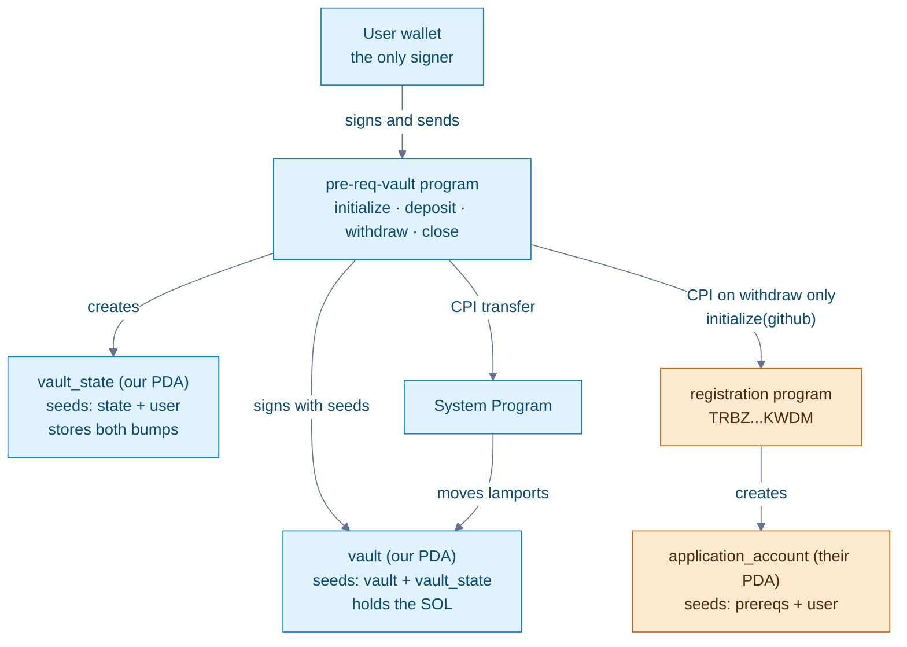

# pre-req-vault

Anchor SOL vault. `withdraw` CPIs Turbin3's registration program and records a GitHub handle.

- **Program (devnet):** [`HZbxjG93btfbrLs9r55hDSg3et4tX3Ktm5uLAVJjwmsw`](https://explorer.solana.com/address/HZbxjG93btfbrLs9r55hDSg3et4tX3Ktm5uLAVJjwmsw?cluster=devnet)
- **Registration tx:** [`43uiqRQi…dmdj93sC`](https://explorer.solana.com/tx/43uiqRQiTCEp4sgENZzZ9DYEgmXsPxpwtyQZKSg5W26Zh9ryE7fhVLHXyjrQKbmE3TchVGt2krbwSf8gdmdj93sC?cluster=devnet)
- **Handle:** `Anshumancanrock`

## Architecture



Rendered copy for linking: [`docs/diagram.png`](docs/diagram.png).

One vault per wallet. Addresses are PDAs seeded with the user's key, so only that user can hit their vault.

| Account | Seeds | Owner |
|---|---|---|
| `vault_state` | `["state", user]` | this program |
| `vault` | `["vault", vault_state]` | System Program |
| `application_account` | `["prereqs", user]` | registration program |

```
initialize   create vault_state, store bumps
deposit      SOL in  (user signature)
withdraw     SOL out (vault PDA) + CPI registration.initialize
close        drain vault, close vault_state
```

`deposit` spends from the user's wallet, so their signature is enough. `withdraw` and `close` spend from a PDA, so the program signs with the vault seeds.

The CPI is in [`withdraw.rs`](programs/pre-req-vault/src/instructions/withdraw.rs). `user` already signed the outer transaction, so that call does not use `with_signer`. The handle is a program constant.

On-chain the registration invoke sits at depth `[2]` under this program, not as a sibling instruction:

```
Program HZbxjG93btfbrLs9r55hDSg3et4tX3Ktm5uLAVJjwmsw invoke [1]
Program log: Instruction: Withdraw
Program 11111111111111111111111111111111 invoke [2]
Program 11111111111111111111111111111111 success
Program TRBZyQHB3m68FGeVsqTK39Wm4xejadjVhP5MAZaKWDM invoke [2]
Program log: Instruction: Initialize
Program 11111111111111111111111111111111 invoke [3]
Program 11111111111111111111111111111111 success
Program TRBZyQHB3m68FGeVsqTK39Wm4xejadjVhP5MAZaKWDM consumed 12966 of 184781 compute units
Program TRBZyQHB3m68FGeVsqTK39Wm4xejadjVhP5MAZaKWDM success
Program log: Registered GitHub handle `Anshumancanrock`
Program HZbxjG93btfbrLs9r55hDSg3et4tX3Ktm5uLAVJjwmsw consumed 28918 of 200000 compute units
Program HZbxjG93btfbrLs9r55hDSg3et4tX3Ktm5uLAVJjwmsw success
```

## Setup

```bash
pnpm install
anchor build
anchor keys sync          # keypair is gitignored; skip this and the program id drifts
solana config set --url devnet
solana airdrop 3
anchor deploy
anchor test --skip-deploy
```

`./scripts/deploy-devnet.sh` does the same and exits early if this wallet is already registered.

Verify on-chain:

```bash
pnpm exec ts-node scripts/check-registration.ts
```

Local replay without spending the one-shot registration — clone the live registration program into a validator:

```bash
solana-test-validator --reset \
  --url https://api.devnet.solana.com \
  --clone-upgradeable-program TRBZyQHB3m68FGeVsqTK39Wm4xejadjVhP5MAZaKWDM

anchor test --provider.cluster localnet --skip-local-validator
```

## Caveats

Things I checked rather than assumed:

- **`withdraw` only works once per wallet.** Registration `init`s the account and the CPI is unconditional, so the second call reverts. I tested whether that strands funds: deposit 2 SOL, withdraw 0.5, retry fails, 1.5 SOL still sitting in the vault, and `close` recovered all of it. `close` performs no CPI, so it stays available.
- **`withdraw(0)` still burns the registration.** There's no `amount > 0` guard, so a zero-value withdraw moves nothing and fires the CPI anyway. The handle is a program constant, so anyone who signs a `withdraw` here gets recorded as `Anshumancanrock` and spends their own one-time registration.
- **Draining the vault fully is fine; draining it nearly fully is not.** It's a 0-byte system account, so it has to end a transaction either empty or rent-exempt. Leaving between 1 and 890,879 lamports fails with `insufficient funds for rent`. A full drain deallocates the account and `close` still works after it.
- **The test asserts the CPI, not just balances.** The version I was given passed with the CPI stripped out entirely, which I confirmed by building that and running it. It now decodes the `ApplicationAccount` and checks the discriminator, user and handle against the IDL.
- **Left as found:** `pnpm lint` fails because the repo pins prettier 2 while the sources were formatted by prettier 3, the LiteSVM test in `test_initialize.rs` ships commented out so `cargo test` runs nothing, and `constants.rs`/`error.rs` still carry counter scaffolding from the template. All unrelated to the CPI, so I left the diff focused.
