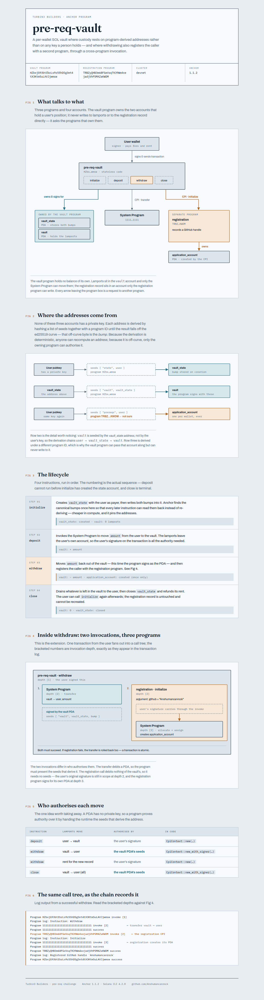

# pre-req-vault

A per-user SOL vault written with Anchor, extended so that a successful `withdraw`
also registers the caller with Turbin3's on-chain registration program via a CPI.

| | |
|---|---|
| Vault program (this repo, devnet) | `HZbxjG93btfbrLs9r55hDSg3et4tX3Ktm5uLAVJjwmsw` |
| Registration program (provided, devnet) | `TRBZyQHB3m68FGeVsqTK39Wm4xejadjVhP5MAZaKWDM` |
| GitHub handle recorded | `Anshumancanrock` |
| Anchor / Solana CLI | 1.1.2 / 4.2.0 |

---

## Architecture

Full diagram: [`docs/architecture.html`](docs/architecture.html) — open it in a browser for
the interactive version, or read it here.

<picture>
  <source media="(prefers-color-scheme: dark)" srcset="docs/architecture-dark.png">
  
</picture>

---

## What the program does

The vault gives every wallet its own SOL holding account that only that wallet can
withdraw from. There is no shared pool and no admin: everything is keyed off the
user's public key, so two users can never touch each other's funds.

Solana programs are stateless, so all of that state lives in accounts. This program
uses two, both **PDAs** — addresses derived from seeds rather than from a private key,
which is what lets the program sign for them.

### The accounts

**`vault_state`** — seeds `["state", user]`, owned by the vault program.
This is the user's record. It stores just two bytes, the bump for each of the two
PDAs:

```rust
pub struct VaultState {
    pub vault_bump: u8,
    pub state_bump: u8,
}
```

Caching the bumps matters. Re-deriving a canonical bump on-chain costs compute, so
`initialize` finds them once and every later instruction reads them back with
`bump = vault_state.vault_bump` instead of searching again.

**`vault`** — seeds `["vault", vault_state]`, a `SystemAccount` holding the lamports.
Note the seed is the *vault_state address*, not the user's — the derivation chains
`user → vault_state → vault`. Because it is a plain system account with no data, the
System Program can move lamports out of it directly, and the vault program authorises
that move by signing with the PDA seeds.

**`application_account`** — seeds `["prereqs", user]`, owned by the **registration**
program, not this one. This is the account the CPI creates. It is typed
`UncheckedAccount` here because this program never reads or writes it; it only passes
it through. The `seeds::program = application_program.key()` constraint still pins the
address to the correct derivation under the registration program.

### The instructions

| Instruction | What it does | Who signs the transfer |
|---|---|---|
| `initialize` | Creates `vault_state`, stores both bumps | — (no transfer) |
| `deposit(amount)` | Moves `amount` from user → vault | the user |
| `withdraw(amount)` | Moves `amount` from vault → user, **then registers the user** | the `vault` PDA |
| `close` | Drains the vault to the user and closes `vault_state`, refunding its rent | the `vault` PDA |

The signing column is the important distinction. `deposit` moves lamports *out of the
user's own wallet*, so the user's signature on the transaction is sufficient:

```rust
let cpi_ctx = CpiContext::new(System::id(), cpi_accounts);
```

`withdraw` and `close` move lamports *out of a PDA*. Nobody holds a private key for a
PDA, so the program asserts authority by passing the seeds that derive it:

```rust
let seeds = &[b"vault", self.vault_state.to_account_info().key.as_ref(), &[self.vault_state.vault_bump]];
let cpi_ctx = CpiContext::new_with_signer(System::id(), cpi_accounts, &[&seeds[..]]);
```

The runtime re-derives the address from those seeds and, if it matches the account
being debited, treats the invoking program as its signer. That is the entire security
model of the vault: only a program that can produce the right seeds can spend from it,
and the seeds contain the user's key.

### State over time

```
(nothing)
   │ initialize      → vault_state created, bumps stored; vault has 0 lamports
   ▼
   │ deposit(1 SOL)  → vault holds 1 SOL
   ▼
   │ withdraw(0.5)   → vault holds 0.5 SOL, user +0.5
   │                   AND application_account created (one time only)
   ▼
   │ close           → vault drained to user, vault_state closed and rent refunded
   ▼
(nothing — initialize can run again; registration cannot)
```

---

## Task 2: the CPI

`withdraw` was given with two accounts it did not use — `application_account` and
`application_program`. The extension wires them into a cross-program invocation to the
registration program's `initialize`, which records a GitHub handle.

The registration interface comes from [`idls/registration.json`](idls/registration.json).
`declare_program!(registration)` reads that IDL at compile time and generates typed Rust
CPI bindings from it, so the call is checked by the compiler rather than hand-rolled:

```rust
declare_program!(registration);
use registration::cpi::{accounts::Initialize, initialize};
```

The added call, in [`withdraw.rs`](programs/pre-req-vault/src/instructions/withdraw.rs):

```rust
let registration_accounts = Initialize {
    user: self.user.to_account_info(),
    account: self.application_account.to_account_info(),
    system_program: self.system_program.to_account_info(),
};

let registration_ctx = CpiContext::new(self.application_program.key(), registration_accounts);

initialize(registration_ctx, GITHUB_USERNAME.to_string())?;
```

Two things are worth calling out:

**No `with_signer` here.** The transfer above it needs one because it debits a PDA. This
call does not: `user` already signed the outer transaction and a signature propagates
down through invokes, so the registration program can use it as the payer for its `init`.
The `application_account` is a PDA of the *registration* program, and that program signs
for its own account's creation internally.

**Anchor 1.x takes a `Pubkey`.** `CpiContext::new` in this version has the signature
`new(program_id: Pubkey, accounts: T)` — hence `self.application_program.key()`. In
Anchor 0.2x it took an `AccountInfo`, which is what most tutorials still show.

The GitHub handle is a `#[constant]` in
[`constants.rs`](programs/pre-req-vault/src/constants.rs) rather than an instruction
argument, which keeps the `withdraw` signature — and therefore the provided tests —
unchanged.

### What the CPI looks like on-chain

Log output from a successful `withdraw`. The nesting depth in brackets is the CPI
chain: this program at `[1]`, the two programs it invokes at `[2]`, and the System
Program that the registration program itself invokes at `[3]`.

```
Program HZbxjG93btfbrLs9r55hDSg3et4tX3Ktm5uLAVJjwmsw invoke [1]
Program log: Instruction: Withdraw
Program 11111111111111111111111111111111 invoke [2]          ← transfer vault → user
Program 11111111111111111111111111111111 success
Program TRBZyQHB3m68FGeVsqTK39Wm4xejadjVhP5MAZaKWDM invoke [2] ← registration CPI
Program log: Instruction: Initialize
Program 11111111111111111111111111111111 invoke [3]          ← registration creates its PDA
Program 11111111111111111111111111111111 success
Program TRBZyQHB3m68FGeVsqTK39Wm4xejadjVhP5MAZaKWDM success
Program log: Registered GitHub handle `Anshumancanrock`
Program HZbxjG93btfbrLs9r55hDSg3et4tX3Ktm5uLAVJjwmsw success
```

---

## Running it

### Prerequisites

Rust, the Solana CLI, Anchor, and pnpm:

```bash
sh -c "$(curl -sSfL https://release.anza.xyz/stable/install)"
cargo install --git https://github.com/solana-foundation/anchor avm --force
avm install 1.1.2 && avm use 1.1.2
npm i -g pnpm
```

### Build and test on devnet

```bash
pnpm install
anchor build
anchor keys sync          # only if you are deploying under your own program ID
solana config set --url devnet
solana airdrop 3          # deploying costs ~1.24 SOL of rent, plus a transient buffer
anchor deploy
anchor test --skip-deploy
```

Then confirm the registration landed:

```bash
pnpm exec ts-node scripts/check-registration.ts
```

which reads the `ApplicationAccount` PDA directly off devnet and decodes it:

```
applicationAccount:  <pda>
owner:               TRBZyQHB3m68FGeVsqTK39Wm4xejadjVhP5MAZaKWDM
REGISTERED: { user: '…', bump: …, preReqTs: false, preReqRs: false, github: 'Anshumancanrock' }
```

### Testing locally first

`withdraw` can only ever succeed **once per wallet** — the registration program creates
the `ApplicationAccount` with `init`, so a second attempt fails with
`Allocate: account … already in use` (custom program error `0x0`). That makes the devnet
run effectively one-shot.

To rehearse the full flow as many times as you like, clone the real registration program
into a local validator:

```bash
solana-test-validator --reset \
  --url https://api.devnet.solana.com \
  --clone-upgradeable-program TRBZyQHB3m68FGeVsqTK39Wm4xejadjVhP5MAZaKWDM

anchor test --provider.cluster localnet --skip-local-validator
```

This runs against the genuine registration bytecode rather than a mock, so a pass here
means the CPI is correct. Use a fresh wallet (`--provider.wallet <path>`) for each repeat
run, or `--reset` the validator, since the same one-shot rule applies locally.

There is also a LiteSVM test in Rust (`cargo test`), which does not touch a validator.

## Layout

```
programs/pre-req-vault/src/
  lib.rs                    # program entrypoints
  state.rs                  # VaultState
  constants.rs              # GITHUB_USERNAME
  instructions/
    initialize.rs           # create vault_state, cache bumps
    deposit.rs              # user  → vault
    withdraw.rs             # vault → user, then the registration CPI
    close.rs                # drain vault, close vault_state
idls/registration.json      # registration interface, consumed by declare_program!
tests/pre-req-vault.ts      # TypeScript integration tests
scripts/check-registration.ts
```
