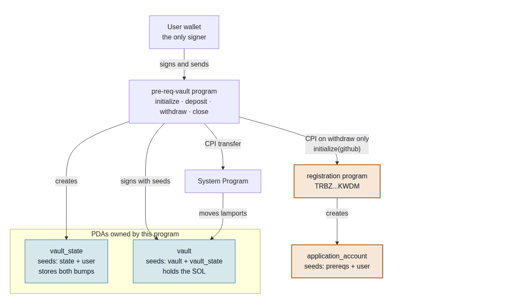

# pre-req-vault

Anchor SOL vault. `withdraw` CPIs Turbin3's registration program and records a GitHub handle.

- **Program (devnet):** [`HZbxjG93btfbrLs9r55hDSg3et4tX3Ktm5uLAVJjwmsw`](https://explorer.solana.com/address/HZbxjG93btfbrLs9r55hDSg3et4tX3Ktm5uLAVJjwmsw?cluster=devnet)
- **Registration tx:** [`43uiqRQi…dmdj93sC`](https://explorer.solana.com/tx/43uiqRQiTCEp4sgENZzZ9DYEgmXsPxpwtyQZKSg5W26Zh9ryE7fhVLHXyjrQKbmE3TchVGt2krbwSf8gdmdj93sC?cluster=devnet)
- **Handle:** `Anshumancanrock`

## Architecture



[Live diagram](https://anshumancanrock.github.io/Turbin3/) · [`docs/diagram.mmd`](docs/diagram.mmd)

One vault per wallet. Addresses are PDAs seeded with the user's key, so only that user can hit their vault.

| Account | Seeds | Owner |
|---|---|---|
| `vault_state` | `["state", user]` | this program |
| `vault` | `["vault", vault_state]` | System Program |
| `application_account` | `["prereqs", user]` | registration program |

```
initialize   create vault_state, store bumps
deposit      SOL in  (user signature)
withdraw     SOL out (vault PDA) + CPI registration.initialize
close        drain vault, close vault_state
```

`deposit` spends from the user's wallet, so their signature is enough. `withdraw` and `close` spend from a PDA, so the program signs with the vault seeds.

The CPI is in [`withdraw.rs`](programs/pre-req-vault/src/instructions/withdraw.rs). `user` already signed the outer transaction, so that call does not use `with_signer`. The handle is a program constant.

On-chain the registration invoke sits at depth `[2]` under this program, not as a sibling instruction:

```
Program HZbxjG93btfbrLs9r55hDSg3et4tX3Ktm5uLAVJjwmsw invoke [1]
Program log: Instruction: Withdraw
Program 11111111111111111111111111111111 invoke [2]
Program 11111111111111111111111111111111 success
Program TRBZyQHB3m68FGeVsqTK39Wm4xejadjVhP5MAZaKWDM invoke [2]
Program log: Instruction: Initialize
Program 11111111111111111111111111111111 invoke [3]
Program 11111111111111111111111111111111 success
Program TRBZyQHB3m68FGeVsqTK39Wm4xejadjVhP5MAZaKWDM consumed 12966 of 184781 compute units
Program TRBZyQHB3m68FGeVsqTK39Wm4xejadjVhP5MAZaKWDM success
Program log: Registered GitHub handle `Anshumancanrock`
Program HZbxjG93btfbrLs9r55hDSg3et4tX3Ktm5uLAVJjwmsw consumed 28918 of 200000 compute units
Program HZbxjG93btfbrLs9r55hDSg3et4tX3Ktm5uLAVJjwmsw success
```

## Setup

```bash
pnpm install
anchor build
anchor keys sync          # keypair is gitignored; skip this and the program id drifts
solana config set --url devnet
solana airdrop 3
anchor deploy
anchor test --skip-deploy
```

`./scripts/deploy-devnet.sh` does the same and exits early if this wallet is already registered.

Verify on-chain:

```bash
pnpm exec ts-node scripts/check-registration.ts
```

Local replay without spending the one-shot registration — clone the live registration program into a validator:

```bash
solana-test-validator --reset \
  --url https://api.devnet.solana.com \
  --clone-upgradeable-program TRBZyQHB3m68FGeVsqTK39Wm4xejadjVhP5MAZaKWDM

anchor test --provider.cluster localnet --skip-local-validator
```

## Caveats

- `withdraw` works once per wallet. The CPI always runs and registration uses `init`, so a second call fails. Remaining SOL still comes out via `close`.
- `withdraw(0)` still registers. The handle is hardcoded, so any wallet that calls this program is recorded as `Anshumancanrock`.
- Don't leave the vault with 1–890,879 lamports. A 0-byte system account has to end a tx empty or rent-exempt.
- Tests decode `ApplicationAccount` (discriminator, user, github), not just balances.
